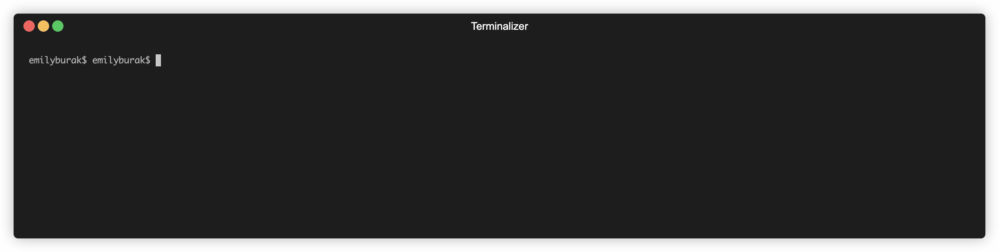
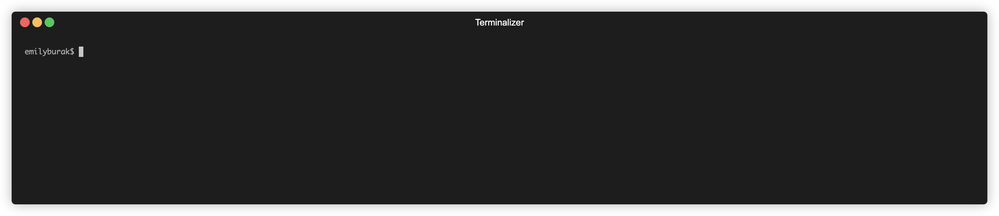

## Gotodo

A to-do list, how novel! Practicing some Golang based on [Dreams of Code's list of golang projects](https://github.com/dreamsofcode-io/goprojects/tree/main/01-todo-list).

### Built with:

- [cobra](https://github.com/spf13/cobra-cli/) for the CLI,
- [fyne](https://pkg.go.dev/fyne.io/fyne/v2@v2.5.2) for desktop notifications,
- [fuzzy](https://pkg.go.dev/github.com/lithammer/fuzzysearch@v1.1.8/fuzzy) for fuzzy searching,
- [progressbar](https://pkg.go.dev/github.com/schollz/progressbar/v3@v3.17.1) for guess what, a progress bar on the pomodoro subcommand,
- [huh](https://pkg.go.dev/github.com/charmbracelet/huh@v0.6.0) for the add subcommand form,
- [bubbletea](https://github.com/charmbracelet/bubbletea) for interactive listtui subcommand list,
- and [viper](https://pkg.go.dev/github.com/spf13/viper@v1.19.0) for config management.

( [terminalizer](https://www.terminalizer.com/) used for example gif-ing. )

---

_Listing example:_

---

_Adding example:_

---

### Key takeaways:

- How golang opens, closes, writes and reads from files, including permissions.
- CSVs are handled weirdly in `encoding/csv` -- why no update record function?
- Lots of string manipulation and printing.
- First CLI from scratch in Golang, whoo.
- `cobra` and `cobra-cli` are very nice to work with from the ground-up.
- Scopes and shadowing are tough, Golang is nice and typed and it was occasionally tough moving from a lot of Python.
- Managing concurrency is made easier by Go, but it still can be hard to get ahold of all the moving parts. It's important to ask yourself if you really need concurrency and its complexity or can deal with a blocking operation/different performance characteristics.
- Using a debugger for concurrent operations is helpful but reading the debugger output can be tough.
- Note to self: keep track of what is being exported and not, as well as directory structure. It can bite you later.
- `bubbletea` is super fun to mess around with once you get in the mindset of the Elm architecture paradigm!

### What's next?:

- Break code up into functions more
- Write tests
- Build out and integrate the `remind` subcommand more.
- Move to a proper DB
- Flocking
- Fully convert to a TUI including launching cobra subcommands from bubbletea
- Deployment and DevOps stuff, after all I am a DevOps engineer <3
